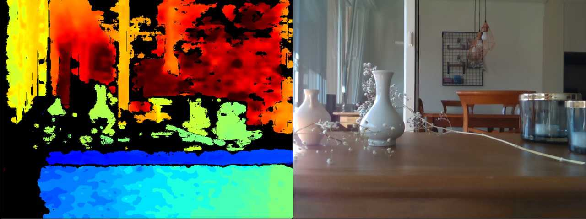
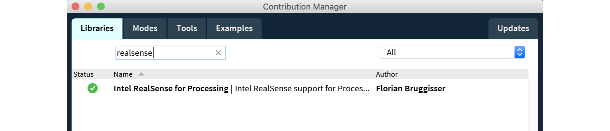

# Intel RealSense for Processing [](https://travis-ci.org/cansik/realsense-processing) [](https://ci.appveyor.com/project/cansik/realsense-processing) [](https://codebeat.co/projects/github-com-cansik-realsense-processing-master)
Intel RealSense 2 support for the [Processing](https://processing.org/) framework.



## Introduction

**Intel RealSense for Procesing** is a port of the **[Intel RealSense](https://github.com/IntelRealSense/librealsense)** library for processing. With this library it is possible to use the Intel RealSense D400 camera series within processing. The idea is **not** to expose the full API into Processing, however a simple and convenient way to work with RealSense devices. For full API support switching over to the underlying [java wrapper](https://github.com/cansik/librealsense-java) is recommended.

Supported Intel RealSense Version: [2.29.0](https://github.com/IntelRealSense/librealsense/releases/tag/v2.29.0)

####  Important

- If you were using **the old API** (PreReleases, dated Feb 2019) and do not want to update your sketch, download the [1.1.0 library](https://github.com/cansik/realsense-processing/releases/tag/1.1.0) from the releases and [install it manually](https://github.com/processing/processing/wiki/How-to-Install-a-Contributed-Library#manual-install) into your processing library folder.
- It is not recommended to kill a sketch in processing, without closing the camera.
- Currently the library is still under development.
- `Linux`, `MacOS` and `Windows` binaries (x86 / x64) are already bundled into the Jar file.


#### Supported Configurations
Here are some configurations I have tested and which are working with the Intel RealSense D435. Please make sure you are using a **USB 3.0 or 3.1** cable!

| width | height | fps                         | depth stream | color stream |
|-------|--------|-----------------------------|--------------|--------------|
| 424   | 240    | `6`, `15`, `30`, `60`       | ✅            | ✅            |
| 480   | 270    | `6`, `15`, `30`, `60`, `90` | ✅            | ❌            |
| 640   | 480    | `6`, `15`, `30`, `60`       | ✅            | ✅            |
| 640   | 480    | `90`                        | ✅            | ❌            |
| 848   | 480    | `6`, `15`, `30`, `60`       | ✅            | ✅            |
| 848   | 480    | `90`                        | ✅            | ❌            |
| 960   | 540    | `6`, `15`, `30`, `60`       | ❌            | ✅            |
| 1280  | 720    | `30`                        | ✅            | ✅            |
| 1280  | 800    | `6`, `15`, `30`, `60`, `90` | ❌            | ❌            |
| 1920  | 1080   | `6`, `15`, `30`             | ❌            | ✅            |

## Installation
There are multiple ways on how to install the library for this repository into your project.

### Contribution Manager
Use the contribution manager inside Processing to directly install the library into your local Processing instance.



### Gradle / Maven
Include the library directly into your gradle / maven build by using [jitpack](https://jitpack.io/#cansik/realsense-processing/latest).

```groovy
repositories {
    maven { url 'https://jitpack.io' }
}

dependencies {
    implementation 'com.github.cansik:realsense-processing:latest'
}
```

### Manual

Download the [latest build](https://github.com/cansik/realsense-processing/releases/tag/contributed) and extract the files into your [processing library](https://github.com/processing/processing/wiki/How-to-Install-a-Contributed-Library) folder.

## Example

Here are some examples which show how to use the library. You will find more [examples here](https://github.com/cansik/realsense-processing/tree/master/examples). 
(*The examples have been tested with a RealSense D430.*)

### Camera

To use a RealSense camera within processing, you have to create a new instance of a `RealSenseCamera`. This object will give you all the possibilities of the API.

```processing
import ch.bildspur.realsense.*;

RealSenseCamera camera = new RealSenseCamera(this);

void setup() {
    // check if a camera is available
    boolean a = camera.isDeviceAvailable();
    
    // check how many cameras are available
    int c = camera.getDeviceCount();
}
```

To start a specific camera device (or multiple of them), check out the [Multi Camera Color Stream example](https://github.com/cansik/realsense-processing/blob/master/examples/MultiCameraColorStream/MultiCameraColorStream.pde).

### Streams

RealSense cameras usually are equiped with multiple Sensors. Mainly video but also depth and position sensors. To use the data streams of these sensors, you have to enable them before starting the camera. It is possible to use the default values (`640x480 30 FPS`) or set your own settings. A complete list of valid settings can be found in the [RealSense Viewer](https://github.com/IntelRealSense/librealsense/tree/master/tools/realsense-viewer) app.

After enabling the streams, you have to call the method `readFrames()` every time you are looking for new frames from the camera. If you do not call this method, your streams will always be black or not updated.

This example activates color and infrared streams and reads their frame data. The frames provided by videostreams are in the `PImage` RGB format. 

```processing
void setup()
{
    size(1280, 480);
    
    camera.enableColorStream(640, 480, 30);
    camera.enableIRStream(640, 480, 30);
    camera.start();
}

void draw()
{
    background(0);
    
    // read frames
    camera.readFrames();
    
    // show images
    image(camera.getColorImage(), 0, 0);
    image(camera.getIRImage(), 640, 0);
}
```

#### Infrared

It is important to notice that the **D415** and **D430** cameras both support multiple infrared streams. To read both of them it is possible to tell the camera, which one to enable and to get. 

```processing
import ch.bildspur.realsense.type.*;

void setup() {
    //...
    camera.enableIRStream(640, 480, 30, IRStream.Second);
}

void draw() {
    //...
    image(camera.getIRImage(IRStream.Second), 0, 0);
}
```

#### Depth
The depth stream of a camera is not pixel based. It usually comes as a 16bit raw byte streams which can be interpreted as depth data. To view this data it is possible to enable the `Colorizer` filter. This filter colorizes the depth data by using a color scheme. It is even possible to change the scheme to eight different presets.

```processing
import ch.bildspur.realsense.*;
import ch.bildspur.realsense.type.*;

RealSenseCamera camera = new RealSenseCamera(this);

void setup()
{
    size(640, 480);
    
    camera.enableDepthStream(640, 480);
    camera.enableColorizer(ColorScheme.Cold);
    
    camera.start();
}

void draw()
{
    background(0);
    
    camera.readFrames();
    image(camera.getDepthImage(), 0, 0);
}
```

### Measure Distance
It is possible to measure distance on a depth frame by using `getDistance(int x, int y)`. This will return you a float which represents the distance from the camera to the selected pixel in *meters*.

```processing
void draw {
    //...
    float distance = camera.getDistance(mouseX, mouseY)
}
```

It is important to notice that usually depth and color streams are not aligned, which makes it impossible to measure depth on a color image. For this problem you will have to [align](#Alignment) the two streams.

### Depth Data
To work with the raw depth data it is possible to enable the depth stream without the colorizer filter and start reading the depth data by using `getDepthData()`. This returns a 2-dimensional array of `short` with the `Y / X` order.

```processing
short[][] data = camera.getDepthData();

for (int y = 0; y < height; y++) {
    for (int x = 0; x < width; x++) {
        int intensity = data[y][x];
    }
}  
``` 

### Alignment
To align all the incoming frames to one specific (by default `depth` to `color` frame), it is possible to enable the alignment as a preprocessor.

```processing
// enable color & depth stream
camera.enableColorStream();
camera.enableDepthStream();
  
// align the depth to the color stream
camera.enableAlign();

camera.start();
```

### Filters
It is possible to use all the filters offered by the RealSense API inside processing. Just **add** the filter by using its add method. Some of the filters offer you to set the configuration settings while adding them. All of them support calling a default constructor (for example `addThresholdFilter()`) to use the default configuration.

```processing
// include the following package for the types
import ch.bildspur.realsense.type.*;

// list of all supported filters
camera.addThresholdFilter(0.0f, 1.0f);
camera.addSpatialFilter(2, 0.5f, 20, 0);
camera.addDecimationFilter(2);
camera.addDisparityTransform(true);
camera.addHoleFillingFilter(HoleFillingType.FarestFromAround);
camera.addTemporalFilter(0.4f, 20, PersistencyIndex.ValidIn2_Last4);

// The following filters have not been tested yet:
camera.addUnitsTransform();
camera.addZeroOrderInvalidationFilter();
``` 

### Configuration
It is possible to load a predefined `JSON` file which contains a custom configuration. These configurations can be created in the RealSense Viewer app provided by Intel. To apply a `JSON` configuration, the camera has to be running alreay:

```processing
// load json config from file
String jsonConfig = String.join("\n", loadStrings("RawStereoConfig.json"));

// enable an example stream and start camera
camera.enableColorStream();
camera.start();

// load a json cofiguration as a string
camera.setJsonConfiguration(jsonConfig);
```

### Advanced
For more advanced topics, the wrapper allows you to use the underlaying Java API through following getter methods.

```processing
// getters for interacting with the java API
Context context = camera.getContext();
Config config = camera.getConfig();
Pipeline pipeline = camera.getPipeline();
PipelineProfile profile = camera.getPipelineProfile();
FrameList frames = camera.getFrames();
```

Also check out the following example, which uses this API getters to display a pointcloud.

- [Pointcloud Example](https://github.com/cansik/realsense-processing/blob/master/examples/PointCloudViewer/PointCloudViewer.pde) (Advanced API)

## FAQ
We try to gather the most frequent questions and answer them here, so we do not have to answer them in every issue.

> The method start(Device) in the type RealSenseCamera is not applicable for the arguments (int, int, int, boolean, boolean)

You are still using the deprecated API. Please update your code to the 2.0 API structure or install the deprecated API as described in the section [Important](Important).

> The image from the RealSense looks distorted and glitchy.

When shutting down the camera without using the `stop()` method, the camera can fall into a bricked state. Just plug out the camera and plug it back in to reset it.

> The camera directly starts with an error that the device could not have been opened.

Either the camera is already used in another application (RealSense-Viewer?) or it is in a bricked state. Just plug out the camera and plug it back in to reset it.

## About

The processing library is maintained by [cansik](https://github.com/cansik) and based on the Intel RealSense [Java wrapper](https://github.com/cansik/librealsense-java).
